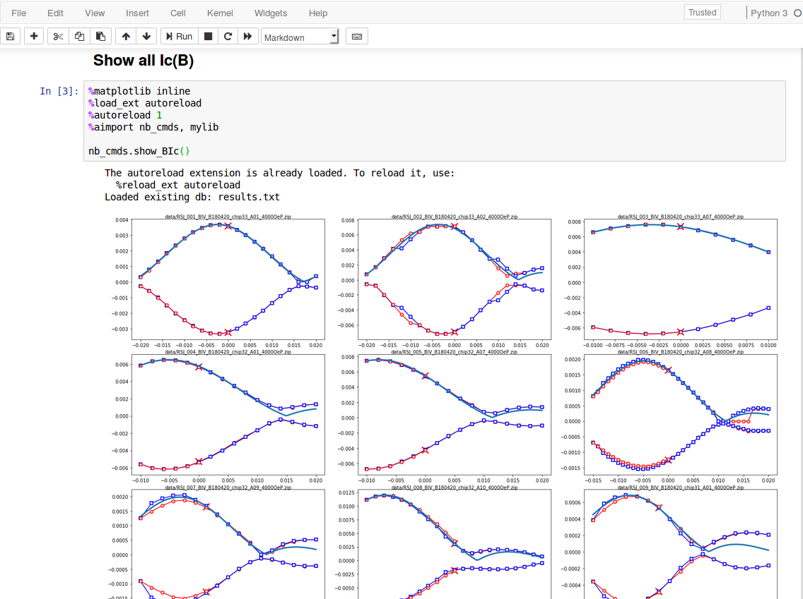

# Cryomem

Python package for experimental research on superconductor-ferromagnet structures. The package includes test/measurment control, data processing, and analysis.

## Features

- Low temperature experiment control: current, voltage, magnetic field, temperature, etc.
- Measurement instrument interfaces via GPIB, serial, USB are included as a subpackage.
- Datafiles are zipped text files for both readability and compact size.
- Metadata is included in zipped datafiles for self-documentation.
- Technical data fitting for magnetic Josephson junctions and superconducting transition temperature measurements.
- Install with pip.
- Certain routine functions (for example, experiment control) can be directly called from the shell command line or scripted for automation.
- Usage of local config files to design experiment control to minimize re-coding case-by-case.
- High internal code-reusability.

## Installation

### Requirements

All should function with Windows 7. Modern Linux systems should work fine except the experiment control. Python 3 is required. Required python packages are numpy, matplotlib, scipy, and pandas. If you use Anaconda distribution,

    conda install numpy matplotlib scipy pandas

Certain, obsolete modules may require additional modules such as xlrd. They should be available from conda or pip.

### Cryomem installation

Go to the root of the repository where setup.py is located, then run

    pip install -e .

To uninstall, run

    pip uninstall cryomem

Depending on the modules to use, you may need to install required packages including numpy, matplotlib, scipy, pandas. If you use an anaconda distribution, run ```conda install <package>```. If the package is not available from conda, ```pip search <package>``` then ```pip install <package>```.

To upgrade the version, cd to the new source and run

    pip install -e . -U

### Test

From the command line, run

    cryomem

It should show available subcommands.

## Usage

### Command line

Although the package is basically a library, some functions/methods can be run from the command line for agile or scripted work. This is recommended for a routine experiment control.

Display help message:

    cryomem [--help]

Display help message for a ```<command>```:

    cryomem <command> --help

General form. ```<parameters>``` is a list of arguments followed by keyword arguments. A keyword argument is given by ```--<key> <value> [more values]```.

    cryomem <command> [<parameters>]

### Python script

Load the code and call help as needed:

    from cryomem.dipprobe.dipprobe import DipProbe
    probe = DipProbe()
    probe.help()

Example with a config file:

    probe.load_config(file="log_R_T.yaml")
    probe.log()

To directly pass parameters without a config file:

    parameters = {
      "device": {
        "R_thermometer": {
          "name": "Thermometer resistance",
          "unit": "K",
	  "read_module": "cryomem.tnminstruments.KT2001",
	  "read_class": "KT2001",
	  "read_class_keyword_arguments": {
	    "interface": "gpib11"
	  },
          "read_method": "read_R4W",
        },
        "t": {
          "name": "Time",
          "read_module": "time",
          "read_method": "time"
        },
        "T": {
          "name": "Temperature",
          "unit": "K",
          "read_module": "cryomem.dipprobe.thermometer",
          "read_class": "Cernox",
          "read_class_keyword_arguments": {
            "serial": "X104724"
	  },
          "read_method": "get_temperature",
          "input_variable": "R_thermometer"
        },
      },
      "sequence": {
        "log": {
          "datafile_increment": "Yes"
          "datafile_name": "testlog.txt",
          "delay": 2,
          "duration": 3600,
          "read": ["t", "R_thermometer", "T"],
	  "plot_prop": ["t", "T"]
        },
	"set_device": {
	  "val": 0
        }
      }
    }
    probe.load_config(parameters=parameters)
    probe.log()

If a config file is already loaded this procedure adds new parameters or overwrites existing ones.

### Config file

Subpackage dipprobe has been written to use config files extensively for test/measurement settings. Measurement instruments, target parameters, DAQ sequence parameters can be specified in a YAML file to achieve both flexibility and efficiency. See .yaml files in ```cryomem/test/dipprobe```, ```cryomem/test/dipprobe2```, or the following section for an example.

A config file is loaded from the command line by a parameter

    --config <config file>

or from a python script by calling a method:

    <instance>.load_config(file=<config file>)

### Example

#### Experiment control

One of the main experiments is measuring Josephson junction current-voltage with a field sweep. I can set up the config file:

    # Define device physical parameters to set or read.
    device:
	
      B:
        name: Field bias
        unit: T
        write_module: cryomem.tnminstruments.SR830
        write_class: SR830
        write_class_keyword_arguments:
          interface: gpib9
        write_method: set_auxvout
        write_method_keyword_arguments:
          channel: 1
        divisors:
          B_per_I: 0.0674
          I_per_V: -2.0
        max: 0.4
        step: 0.0005
        delay: 0.001
		
      IV:
        name: IV trace
        unit:
        - A
        - V
        read_module: cryomem.tnminstruments.KS6000X
        read_class: KS6000X
        read_class_keyword_arguments:
          interface: USB0::0x0957::0x1790::MY54130118::INSTR
        read_method: get_wfm
        read_method_keyword_arguments:
          acquire: yes
          scale:
          - 0.002
          - 0.0001
        init_method: config_wfm
        init_method_keyword_arguments:
          ch:
          - 1
          - 2
          mode: average
	
	# Specify arguments passed to the sequences (hard-coded) that
	# set or read physical quantities defined above.
    sequence:
	
      set_device:
        val: 0
		
      sweep:
        datafile_increment: yes
        datafile_name: testrun
        delay: 2
        sweep:
        - B
        read:
        - IV

Then I can run a sweep:

    cryomem dipprobe2 sweep --config MJJ.yaml --datafile_name testsweep --range 0 0.002 0.006 -0.001 -0.01 0.002 0

Note ```datafile_name``` is updated by the command line argument. Resulting data (including metadata) are saved to data/001_testsweep.zip.

#### Analysis

Code for scientific analysis is included. I usually use Jupyter notebook for the integrated documentation capability. See under cryomem/test/dipprobe2 for an example.



### Implemented functions

- dipprobe DAQ
  - Instrument control: GPIB, RS232, USB (VISA or DLL wrapper).
  - Superconductor resistance vs temperature
  - Josephson junction current vs voltage with a magnetic field sweep

- YAML configuration file handling

- Zip-format datafile handling

- Fit
  - Superconducting transition temperature from a resistance-temperature measurement.
  - Josephson junction current vs voltage: resistively-shunted junction model, Ambegaokar-Halperin.
  - Josephson junction critical current vs field: Fraunhofer pattern, Airy.
  - Magnetic JJ characteristic voltage (IcRn) vs magnetic layer thickness: clean limit.
  - Wedge thin film thickness distribution.

## Development

### Structure

Subpackages are intended to be independent from each other except "common" subpackage. Example subpackages:

- common: shared utility code
- data: static data requiring frequent access (ex: thickness calibration data)
- analysis: data analysis including fit.
- dipprobe2: new dipprobe control code
- fab: code for fab parameters
- test: examples
- cmtools, dipprobe: old dipprobe control code

### Command line execution

The entrypoint is "cryomem.py". The run commands are registered in the beginning of the entrypoint module.

### Miscellaneous

- SQL and noSQL databases have been tried for data storage but I settled down to local storage. Agility/portability is more important than scaling in most small-scale research.
- The speed of scientific data fitting can be improved by parallel processing especially if multi-dimensional numerical integration is involved. Ambegaokar-Halperin fitting has been improved by the number of the used CPU cores, for example. GPU programming could improve it further if needed.
- Resistance vs temperature measurement pops open a live plot but otherwise I didn't bother to add such a live visualization. JJ measurements could be visualized by surface plotting the accumulated I-V curves or even open a parallel thread/process for live-fitting and plotting selected fit parameters.
- GUI experimental control has been tried in cmtools subpackage (cmdaq-gui). This combines editing config and batch files with command line shell in a frame. That subpackage has been deprecated but such a GUI can be implemented for newer subpackages too. Adding a live plot should make it quite complete.
- Multithread experiment control has been considered. Such a scheme has, for example, main kernel, user interface, and instrument control in separate threads and processes. Message-based communication makes this scheme modular and even distributed (over nodes). The kernel can be in the background and keep track of the instrument status (which helps in dealing with simple instruments and unified failsafe mechanism). The kernel is always responsive to the user and unaffected by unresponsive instruments or data processing unit.
- I use SI units implicitly. It would be good to handle units explicitly.

## Research enabled by Cryomem

- Anomalous Supercurrent Modulation in Josephson Junctions With Ni-Based Barriers. ([https://doi.org/10.1109/TASC.2018.2836961](https://doi.org/10.1109/TASC.2018.2836961))
- Phase Offsets in the Critical-Current Oscillations of Josephson Junctions Based on Ni and Ni-(Ni<sub>81</sub>Fe<sub>19</sub>)<sub>x</sub>Nb<sub>y</sub> Barriers. ([https://doi.org/10.1103/PhysRevApplied.7.064013](https://doi.org/10.1103/PhysRevApplied.7.064013))
- Spin-Transfer Torque Switching in Nanopillar Superconducting-Magnetic Hybrid Josephson Junctions. ([https://doi.org/10.1103/PhysRevApplied.3.011001](https://doi.org/10.1103/PhysRevApplied.3.011001))
- Hybrid superconducting-magnetic memory device using competing order parameters. ([https://doi.org/10.1038/ncomms4888](https://doi.org/10.1038/ncomms4888))
